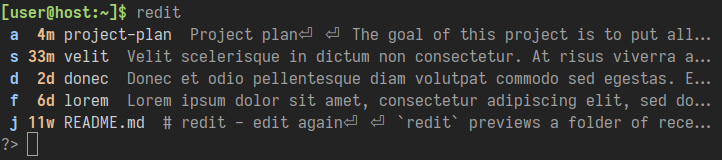

# redit - edit again

`redit` previews a folder of recently edited text files and launches an editor on the file of your choice.

`redit` is useful when you keep a folder of textual notes and you want to go back to a recently edited file whose name you might not remember. In this case you would type `redit` and be greeted with this interactive prompt:



Answering with `j`, `enter` will then directly load `README.md` into your editor.

You can set a default directory to look for files (say, `~/notes`) in `~/.config/redit/default-location` like this:

```shell
mkdir -p ~/.config/redit && echo '~/notes' > ~/.config/redit/default-location
```

Alternatively you can provide a location with `redit ~/Downloads` and finally `redit` falls back to the current directory.


## Installation

```shell
pip install redit
```
